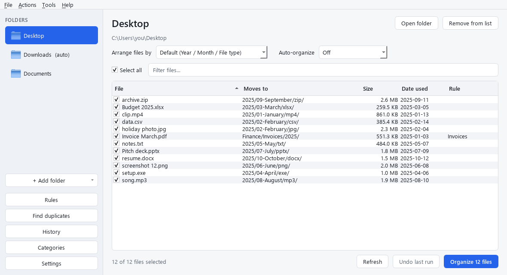

# 🗂️ Desktop Organizer

**Version 1.3.0** · Windows 10 and 11 · [Changelog](CHANGELOG.md) · [User guide](docs/user-guide.html)

Desktop Organizer tidies your Desktop, Downloads, Documents or any folder by
sorting loose files into folders, in a layout **you** choose. You see where
every file will go before anything moves, every run can be undone, and if you
lose track of a file, it helps you find or recover it.



> All features are currently free. Free and Premium tiers will come with
> licensing in a later release.

## 📥 Install

| Download | Use it when |
| --- | --- |
| `DesktopOrganizer-1.3.0-Setup.exe` | Normal install. No admin rights needed; adds a Start menu entry and an uninstaller. |
| `DesktopOrganizer-1.3.0-portable.zip` | No install. Unzip anywhere and run `DesktopOrganizer.exe`. |

The installer isn't code-signed yet, so Windows may show **"Windows protected
your PC"**. Click **More info**, then **Run anyway**.

Uninstalling keeps your settings, undo history and saved file versions, so a
reinstall picks up where you left off.

## 🚀 Features

### Organize

- **Live preview** of where every file will go. Untick files to leave them,
  filter the list, then click **Organize**.
- **Any folder**: Desktop, Documents, Downloads, Pictures, Music, Videos or one
  you pick, each with its own layout. Follows Windows' OneDrive redirects.
- **Ready-made layouts**: File type · Category · Year / Month ·
  Year / Month / File type · Year / Month / Category.
- **Build your own layout** from placeholders, e.g. `Work/{category}/{year}`:

  | Placeholder | Example | Placeholder | Example |
  | --- | --- | --- | --- |
  | `{year}` | 2025 | `{quarter}` | Q1 |
  | `{month}` | 01-January | `{type}` | pdf |
  | `{month_num}` | 01 | `{category}` | Documents |
  | `{month_name}` | January | `{size}` | Small, Medium, Large, Huge |
  | `{month_short}` | Jan | `{first_letter}` | R |
  | `{day}` | 05 | | |

- **Your own categories**, e.g. *Invoices = pdf*, used by `{category}`.
- **Rules** checked before the layout, e.g. *name contains "invoice" and type
  is pdf → `Finance/Invoices/{year}`*, or *leave these files alone*. Conditions
  cover name, type, size and age; a rule can apply to every folder or one.
- **Undo** any run from History. Folders a run created are removed again, and
  files are never overwritten.

### Automate

- **Auto-organize** each folder *when new files arrive*, *every hour* or
  *every day*. Files are only moved once they've stopped changing, and
  downloads still in progress (`.crdownload`, `.part`, …) are never moved.
- **System tray**: closing the window keeps the app running so auto-organize
  keeps working (Open · Run now · Pause · Quit), with optional notifications
  and *Start with Windows*.
- **Find duplicates** by content, keep the oldest copy, and send the extras to
  the Recycle Bin.

### Find & recover (Ctrl+F)

- **Find a file**: type part of a name to see where it is now, and for files
  the organizer moved, where it came from and when. Open it or show it in
  File Explorer.
- **File versions**: protect a folder and the app keeps the **last 4 saved
  versions** of every file in it (adjustable from 1 to 20). Restore an earlier
  version, save a copy, or bring back a protected file that was deleted.
- **Recycle Bin**: see what's in the Recycle Bin with each item's original
  location and deletion date, and put items back where they came from.

### Safe and private

- Refuses drive roots, your whole user folder and system folders, and warns
  before touching software or Docker projects (folders with `.git`,
  `Dockerfile`, `package.json`, …).
- Never moves shortcuts, hidden or system files, or Office lock files.
- Works offline with no account. It only goes online to check for updates,
  when you choose **Help › Check for updates...** or turn on the weekly check
  (off by default).
- Only one copy runs at a time; opening it again brings the running copy
  forward.
- Problems are written to a log, and unexpected errors show a dialog with
  details to copy instead of closing the app.

## ⌨️ Keyboard shortcuts

| Shortcut | Action |
| --- | --- |
| Ctrl+F | Find a file |
| Ctrl+Shift+V | File versions |
| Ctrl+Enter | Organize the ticked files |
| Ctrl+Z | Undo the last run |
| F5 | Refresh the preview |
| Ctrl+O | Add a folder |
| Ctrl+R | Rules |
| Ctrl+D | Find duplicates |
| Ctrl+H | History |
| Ctrl+Q | Quit |

## 📁 Where your data lives

Everything is stored in `%APPDATA%\DesktopOrganizer` on Windows
(`~/Library/Application Support/DesktopOrganizer` on macOS,
`~/.local/share/DesktopOrganizer` on Linux when run from source):

| Path | What it holds |
| --- | --- |
| `settings.json` | Folders, layouts, rules, categories and preferences |
| `history.db` | Every move, so any run can be undone |
| `versions/` | Saved versions of files in protected folders |
| `logs/` | A small rotating log (also via **Help › Open log folder**) |

---

## 🧑‍💻 Run from source

Requires Python 3.10 or newer.

```bash
pip install -e .[dev]
python main.py              # opens the app window
python main.py --version
```

### Command line

```bash
python main.py preview downloads
python main.py organize --all                      # every saved folder
python main.py organize docs --pattern "{category}/{year}"
python main.py undo
python main.py history
python main.py folders add downloads --mode category
python main.py structure set --pattern "Work/{category}/{year}"
python main.py structure tokens                    # list placeholders
python main.py categories add Invoices pdf
python -m desktop_organizer                        # text menu
```

## 🧪 Tests

```bash
python -m pytest
```

127 tests, including headless tests of every window. Tests never touch your
real folders: the Desktop, Downloads, settings and Recycle Bin are all
redirected to temporary folders.

## 📦 Build the Windows app

```bash
pip install -e .[build]                 # PyInstaller
winget install JRSoftware.InnoSetup     # for the installer (optional)
python packaging/build.py               # add --no-installer to skip Inno Setup
```

Output in `dist/`:

```text
dist/DesktopOrganizer/DesktopOrganizer.exe       the app folder
dist/DesktopOrganizer-<version>-portable.zip
dist/DesktopOrganizer-<version>-Setup.exe
```

The installer's `AppId` in `packaging/installer.iss` must never change:
Windows uses it to treat new versions as upgrades of the same app.

## 🔢 Versioning and releases

The app uses [Semantic Versioning](https://semver.org): **PATCH** for bug
fixes, **MINOR** for new features, **MAJOR** for changes that may break
settings or habits. The version lives in one place,
`desktop_organizer/__init__.py`; the command line, About box,
`pyproject.toml`, the `.exe` properties and the installer all read it from
there.

1. While working, add notes under `## [Unreleased]` in [CHANGELOG.md](CHANGELOG.md).
2. Bump the version; this also moves the Unreleased notes under the new number:

   ```bash
   python scripts/bump_version.py minor     # or patch / major / 1.4.0
   python scripts/bump_version.py --show    # current version
   ```

3. Commit, tag and build:

   ```bash
   git commit -am "Release 1.4.0"
   git tag -a v1.4.0 -m "Desktop Organizer 1.4.0"
   python packaging/build.py
   ```

4. Publish so update checks can find it: push the branch and tags
   (`git push origin <branch> --tags`), then on
   [GitHub Releases](https://github.com/Kevonia/Desktop-Organizer/releases)
   create a release from the tag, paste the changelog notes, and attach the
   `-Setup.exe` and portable zip. The app's **Download** button links straight
   to the file ending in `-Setup.exe`.

## 🧱 Project layout

```text
desktop_organizer/
  __init__.py           app name and version (single source)
  cli.py                command line and text menu
  core/                 engine with no UI code (shared by the CLI and the app)
    organizer.py        the facade both UIs talk to
    config.py           settings, saved folders, preset layouts
    paths.py            Desktop/Downloads/... and app-data locations
    scanner.py          which files are eligible
    rules.py            plans where each file goes
    structure.py        layout patterns and placeholders
    categories.py       extension -> category map
    user_rules.py       rule conditions and actions
    dates.py            which date a file belongs to
    mover.py            performs moves and logs them
    history.py          SQLite undo log
    safety.py           forbidden folders and project warnings
    auto.py             auto-organize (watch / hourly / daily)
    duplicates.py       duplicate finder
    search.py           find files by name
    versions.py         version history for protected folders
    recycle_bin.py      read and restore Recycle Bin items
    trash.py            send to the Recycle Bin / Trash
    startup.py          start with Windows
    updates.py          check GitHub Releases
    logs.py             rotating log file
    version.py          parse, compare and bump versions
  ui/                   PySide6 app
    app.py              entry point
    main_window.py      folders, preview, organize/undo, tray, auto-organize
    dialogs.py          layout builder, categories, history, settings
    tools.py            rules editor, duplicate finder
    recover.py          Find & recover window
    single_instance.py  one running copy
    errors.py           crash dialog
    theme.py            light and dark themes
    worker.py           background threads
  resources/icon.svg
packaging/              build.py, installer.iss, launcher.py
scripts/bump_version.py version bump and changelog roll
docs/                   user guide and project briefing (HTML and Word)
tests/                  pytest; GUI tests run headless
```

## 📚 Documents

- [User guide](docs/user-guide.html) (also `docs/user-guide.docx`)
- [Project briefing](docs/briefing.html) with SWOT, PESTEL, competitors and
  roadmap (also `docs/briefing.docx`)

## 🗺️ Roadmap

- [x] 1.0: desktop app, any folder, custom layouts, undo, Windows installer
- [x] 1.1: rules, auto-organize, tray, start with Windows, duplicate finder
- [x] 1.2: one copy at a time, update checker, error log and crash dialog
- [x] 1.3: Find & recover: file search, version history, Recycle Bin restore
- [ ] 1.4: licensing (Free and Premium) and in-app upgrade
- [ ] 1.5: code signing, first public release, website
- [ ] 2.x: macOS build, Microsoft Store listing

## 🛠️ License

MIT. The Windows app bundles [Qt for Python (PySide6)](https://www.qt.io/qt-for-python),
used under the [GNU LGPL v3](https://www.gnu.org/licenses/lgpl-3.0.html), and
the Python runtime under the [PSF License](https://docs.python.org/3/license.html).
